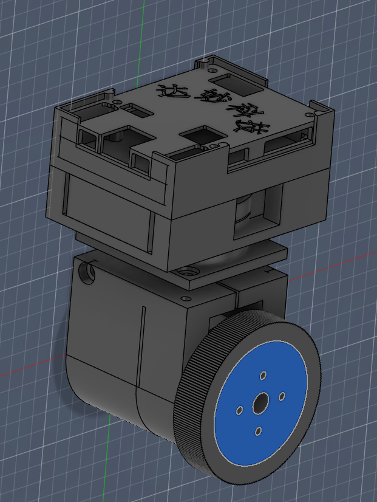

# Rocky

Rocky is a 3-BLDC motor desktop AI gimbal project.



Quick start
- Open the project in STM32CubeIDE and load [rocky.ioc](rocky.ioc).
- Build in the IDE or run the debug makefile from the `Debug` folder:

```powershell
cd Debug
make all
```

Project renamed from `simple-gimbal` to `rocky`.
